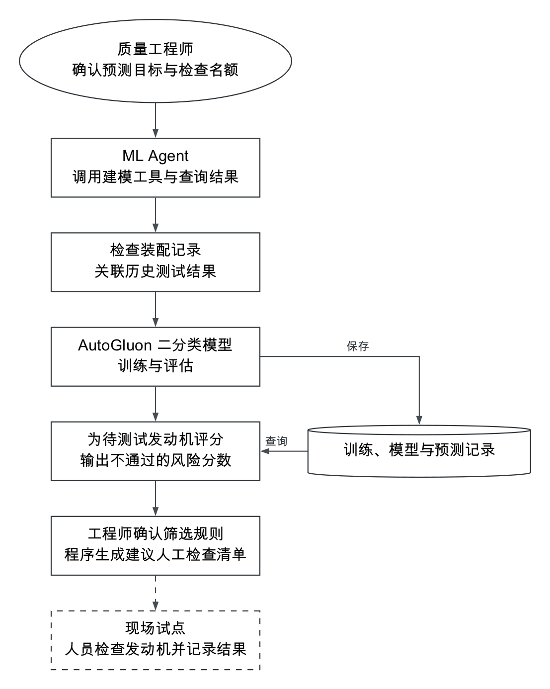
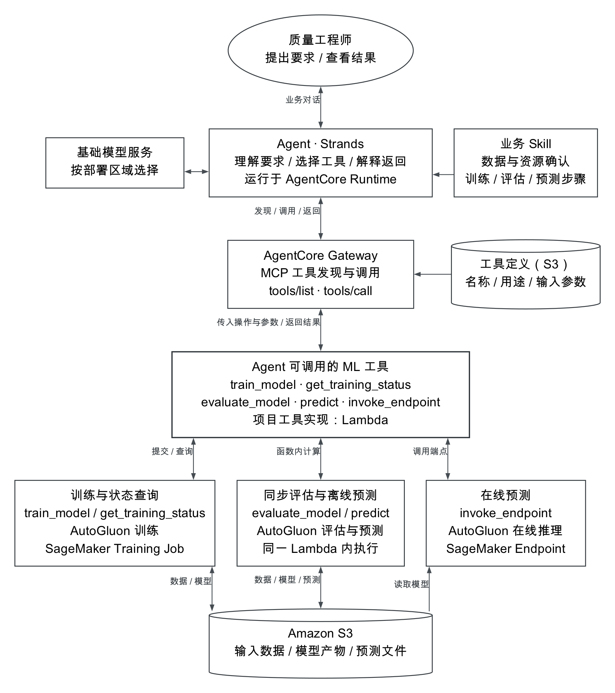
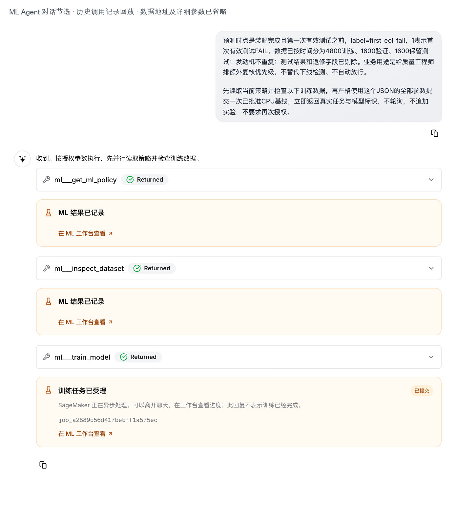
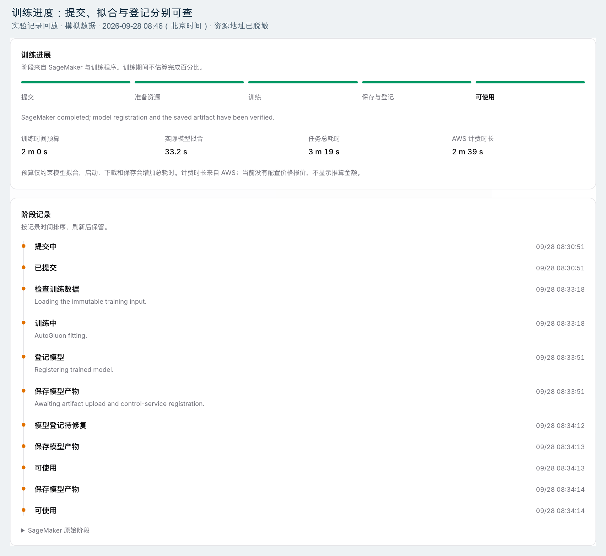
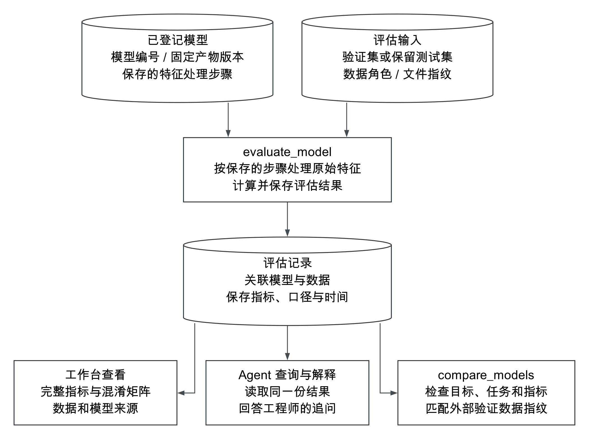
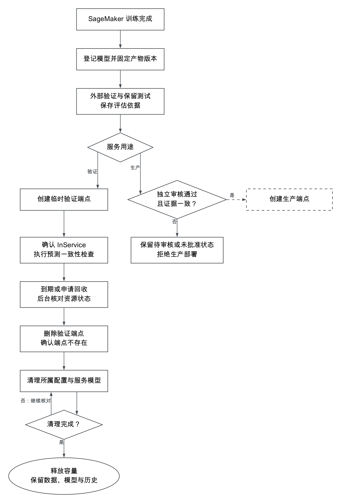
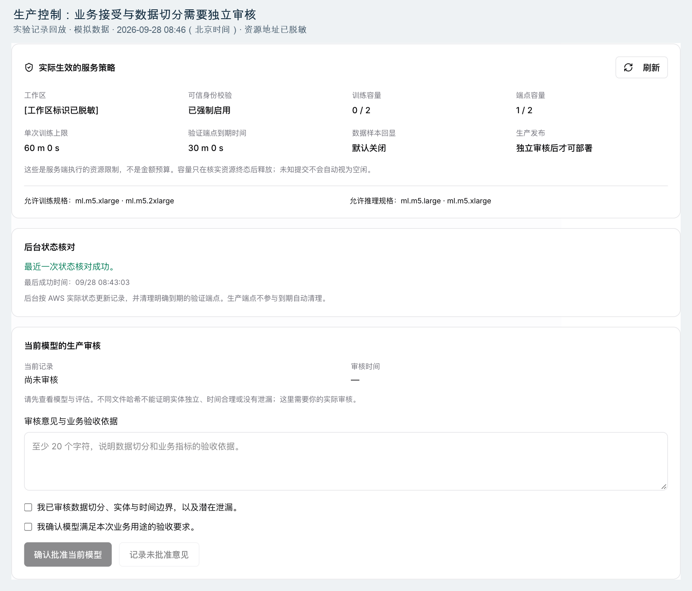

# 基于 Amazon Bedrock AgentCore 和 Amazon SageMaker AI 构建装配质量分析 Agent

[下载完整资料包](https://github.com/weichaoabc/assembly-quality-agent-blog/releases/download/v2026.09.29/blog-ml-agent-customer-final.zip) · [下载 Word](https://github.com/weichaoabc/assembly-quality-agent-blog/releases/download/v2026.09.29/blog-ml-agent-paper.docx)

发动机完成装配后，能否一次通过下线测试，是质量团队关注的问题。拧紧记录、工位等待和设备状态中包含了有用的信息，但把这些记录整理成数据、训练模型，再将结果用于现场工作，需要质量、数据和平台团队协作。

本方案基于 Amazon Bedrock AgentCore 和 Amazon SageMaker AI 构建装配质量分析 Agent。工程师通过对话提出分析要求，Agent 调用工具完成数据检查、AutoGluon 建模、模型评估和预测，并协助解释结果。模型在发动机首次下线测试前给出风险分数，供质量团队安排额外人工检查。AgentCore 承载 Agent 并提供 MCP 工具接入，SageMaker AI 承担模型训练与在线推理，业务 Skill 指导 Agent 按质量分析流程组织操作。

本文从业务场景、架构设计、使用流程和部署实践四个方面介绍方案，并说明中国区域的部署安排。文中的装配数据为模拟数据，用于说明建模方法与业务流程。配套示例数据和实践指南集中在文末，便于团队结合自身产线开展实践。

## 客户问题与适用范围

### 明确模型要解决的问题

本例使用 AutoGluon 训练一个表格数据的二分类模型，预测发动机能否通过首次下线测试。模型学习历史装配记录与测试结果之间的关系，再为尚未测试的发动机输出“不通过”的风险分数。

| 建模要素 | 本文的具体设置 |
|---|---|
| 输入数据 | 每台发动机的拧紧扭矩与角度偏差、重复拧紧、工位等待、设备状态等装配记录 |
| 训练标签 | 该发动机首次下线测试的“通过”或“不通过”结果 |
| 预测时点 | 装配完成后、首次下线测试之前，只使用当时已经获得的数据 |
| 预测输出 | 每台待测试发动机对应的不通过风险分数 |

这里的首次测试，指第一次获得有效结果的下线测试。后续复测通过，不会改写首次测试失败的标签；尚未取得有效结果的发动机，也不会被当作通过样本训练模型。

质量团队可以利用风险分数安排额外人工检查。工程师或现场人员核对装配记录、工位异常和工具状态，必要时检查发动机实物，再决定处理措施。工程师也可以与 Agent 交流，比较模型表现、查询任务结果或理解预测依据。

“建议人工检查的发动机清单”列出发动机编号和风险分数。质量团队确定风险阈值及每天可以检查的数量，配套程序据此筛选发动机。风险分数帮助分配检查资源，所有发动机仍按既定流程完成下线测试与放行。

### 方案提供的能力

质量分析往往从一个业务问题开始，经过多轮数据确认和模型调整，才形成可使用的结果。Agent 把这些操作放进连续的对话中，并将每一步与实际任务、模型和结果文件关联起来。

| 实际需求 | 方案提供的能力 | 工程师获得的结果 |
|---|---|---|
| 将质量问题转成建模任务 | Agent 确认目标与数据，调用 AutoGluon 工具 | 可继续跟进的训练任务与模型 |
| 跟进后台训练 | 提交任务后，可在对话或工作台查询进度 | 无需停留在原对话中等待训练 |
| 理解并比较模型 | 查询评估结果、特征影响和模型版本 | 有数据依据的分析结论 |
| 对新发动机进行评分 | 使用已登记模型执行文件预测或在线预测 | 可用于筛选检查对象的风险分数 |
| 将模型纳入业务运行 | 配置访问权限、发布审核、监控和资源管理 | 可管理、可追溯的模型服务 |

### Agent 与质量团队如何协作

质量团队负责明确预测目标、检查条件和处置方式；数据团队负责装配记录、测试结果及字段含义；平台团队负责工具接入、计算环境和权限。Agent 使用已有基础模型理解要求，通过工具调用 AutoGluon 训练质量预测模型，并协助查询和解释结果。

例如，工程师可以先询问数据能否用于建模，再要求比较不同特征，随后追问某项指标为什么变化。业务 Skill 指导 Agent 按照约定的步骤处理这些请求，工具服务执行实际计算并保存结果。现场检查和模型发布审核由人员负责。

对于已经稳定的日常评分流程，可以通过调度程序调用同一套工具服务；需要澄清、比较和追问的分析工作，则可以保留对话入口。这样，交互式分析与日常运行共享建模能力，并分别采用适合的使用方式。

*图1　从装配数据到风险评分和人工检查的业务流程。虚线部分表示与现场检查、工单及处理结果的业务衔接。*

## 架构设计与取舍

### 将 AutoGluon 能力封装为 Agent 工具

本方案围绕 AutoGluon 的 `TabularPredictor` 接口封装训练、评估和预测能力，并提供数据检查与任务查询工具。Agent 根据工具的名称、用途和输入说明选择操作，由工具背后的服务完成计算。下表列出一次建模过程中的主要调用，完整工具清单见附录A。[1][8]

| 工程师的要求 | Agent 调用的工具 | 工具执行与返回 |
|---|---|---|
| 检查这份数据能否用于建模 | `inspect_dataset` | 检查字段、缺失值与标签分布 |
| 用这些数据训练模型 | `train_model` | 提交 AutoGluon 后台训练，返回任务和模型编号 |
| 查看刚才的训练进展 | `get_training_status` | 查询训练状态，确认模型是否可用 |
| 用指定数据评估模型 | `evaluate_model` | 计算指标，保存评估结果及数据来源 |
| 为新数据生成预测 | `predict` | 使用已登记模型预测，将结果文件保存到 S3 |

例如，工程师要求“训练模型后告诉我效果”时，Agent 先确认数据、预测目标和资源范围，再提交训练。模型就绪后，Agent 调用评估工具，并依据工具返回的指标解释结果。任务和模型编号把这些操作连接起来，也让工程师能够从工作台继续查看。

### 通过 MCP 发现并调用工具

AgentCore Gateway 将工具服务以 MCP 接口提供给 Agent。开发人员将承载工具实现的 Lambda 函数注册为 Gateway 目标，登记工具名称、用途和输入参数，再为 Agent 配置允许使用的工具。[4]

Agent 应用通过 MCP 的 `tools/list` 获取工具说明，通过 `tools/call` 发起调用。Gateway 将请求转给 Lambda 中的 ML 工具服务，服务完成权限与输入检查后执行，并将结果返回 Agent。[4][7]

因此，工程师与 Agent 对话时，Agent 能够使用的是已经注册并配置的建模工具。Lambda 承载这些工具的实现；AutoGluon 提供建模计算能力。两者通过 Gateway 接入对话流程，各自承担不同职责。

*图2　装配质量分析 Agent 的工具接入与计算架构。AgentCore Runtime 运行 Agent，Gateway 提供 MCP 工具接入，Lambda 承载 ML 工具；AutoGluon 训练与在线推理使用 SageMaker AI，小规模评估和文件预测在 Lambda 中执行。基础模型服务按部署区域和业务要求选择。*

### 用业务 Skill 组织工具调用

工具说明回答“这个操作能做什么”，业务 Skill 则告诉 Agent 在质量分析中何时使用它、先确认哪些条件，以及如何解释结果。例如，训练前应确认预测目标和数据范围，评估时应区分用于调整模型的数据和用于最终判断效果的数据，生成风险分数后应说明它的业务用途。

工程师可以用业务语言提出要求，Skill 帮助 Agent 将要求组织成一系列工具调用。调整质量分析流程时，可以修改 Skill 中的业务说明；增加新的计算能力时，则需要扩展工具实现及 Gateway 配置。

权限、资源限制和发布条件由服务端执行。Skill 指导工作顺序，后端对实际操作负责。业务 Skill 清单见附录B；日期、文件与 Skill 读取等 Agent 辅助工具见附录C。

### AutoGluon 的执行环境

工具入口与建模计算分开设计。Lambda 中的训练工具提交 SageMaker AI Training Job，AutoGluon 随后在训练容器中拟合并选择模型。小规模模型评估和文件预测由 Lambda 加载模型执行；需要在线预测时，工具将请求转交给 SageMaker AI 端点。

| 执行环节 | 运行位置 | 执行方式 |
|---|---|---|
| 模型训练 | SageMaker AI 训练容器 | 读取 S3 数据，训练并选择模型，将模型文件写回 S3 |
| 小规模评估与文件预测 | ML 工具服务的 Lambda 容器 | 加载已登记模型，计算指标或生成预测文件 |
| 在线预测 | SageMaker AI 推理容器 | 加载指定模型，响应业务系统的预测请求 |

Agent 使用 Strands Agents SDK 组织模型交互与工具调用，在 AgentCore Runtime 中运行。基础模型服务负责理解业务要求和选择工具，可根据部署区域和企业要求配置。[2][3] 门户通过 Amazon API Gateway 和 Lambda 提供聊天与 ML 工作台；Amazon S3 保存数据、模型及预测文件，Amazon DynamoDB 保存任务和审核记录，Amazon CloudWatch 提供日志与指标。

训练、推理和工具服务的容器镜像由 Amazon ECR 管理。模型版本同时关联训练数据与特征处理步骤，使评估、文件预测和在线推理使用一致的数据处理方式。[5]

随着数据量或模型规模增长，评估可以采用 SageMaker AI Processing，批量预测可以采用独立作业或适配 Batch Transform。[11] 这类部署中，Lambda 继续负责接收工具请求、提交作业和查询结果，Agent 通过任务编号跟进进度。具体执行方式应结合数据规模、响应时间和成本选择。

### 关键设计选择

架构将业务交互、工具接入和计算执行分开，便于在业务流程变化或计算规模增长时调整相应部分。

| 设计选择 | 在本方案中解决的问题 | 需要考虑的取舍 |
|---|---|---|
| 用 MCP 接入 AutoGluon 工具 | 为 Agent 提供统一的建模能力入口 | 工具说明与后端实现需要同步维护 |
| 用 Skill 组织业务步骤 | 让 Agent 按质量分析流程调用工具 | 业务规则需要清晰，并由服务端执行必要约束 |
| 分开训练提交与状态查询 | 支持长时间运行的训练及后续追问 | 需要维护任务状态和恢复机制 |
| 按规模选择计算环境 | 兼顾小规模交互与大规模后台作业 | 需要评估模型加载、计算耗时与资源成本 |
| 分别保存会话与任务记录 | 让对话和计算结果都能持续查询 | 需要用稳定的任务和模型编号建立关联 |

企业可以从一个明确的质量分析场景开始，逐步扩展工具和使用团队。统一工具接入、最小权限和运行监控，有助于把一次建模工作沉淀为持续可用的企业服务。[10]

### 会话任务与模型的关联

工程师关闭页面后，训练任务仍可能继续运行。因此，会话历史和后台任务分别保存：门户在 DynamoDB 中保存聊天历史，ML 服务维护训练进展、模型版本、评估和审核记录。需要跨会话检索上下文时，可结合部署区域支持的记忆能力进行配置，例如 AgentCore Memory。[9]

工程师再次询问“刚才的模型训练完成了吗”，Agent 根据已有任务编号查询后台状态。网络中断后的重试也沿用原任务信息，避免把一次操作重复提交为多个训练任务。

模型记录关联训练数据、处理步骤和模型文件。工程师既可以在对话中追问，也可以进入工作台查看模型及其评估结果。这样的关联让分析结论有依据可查，也便于团队交接和后续改进。

### 身份与执行授权

企业部署时，可通过 OpenID Connect 对接 Microsoft Entra ID，将企业用户映射到应用角色和工作区。[6] 质量工程师、数据人员和平台管理员根据职责获得相应的数据访问与工具调用权限。

工具服务在执行前核验操作者、工作区、请求内容及资源范围。本方案通过短时授权信息与 AWS KMS 消息认证码关联这些信息，使权限检查落实到实际执行环节。

模型用于生产前，由独立审核人确认用途和评估依据。审核与指定模型版本关联，模型或评估条件变化后重新确认。工程师可以通过 Agent 推进分析工作，生产发布仍遵循企业既有的质量管理与审批流程。

## 一次质量分析任务

### 准备装配数据与测试结果

建模首先需要把装配过程与下线测试结果对应起来。以发动机编号为关联依据，将扭矩与角度偏差、重复拧紧、工位等待和设备状态等记录整理为模型输入，再加入首次下线测试的通过或不通过结果。

这些字段必须在预测时已经可用。例如，在下线测试之后才产生的测量值和返修记录，可以帮助分析结果，但不能作为测试前预测的输入。同一台发动机的记录也应归入同一组数据，避免模型在评估时再次看到训练中使用过的对象。

历史数据按时间分为训练集、验证集和测试集：较早的数据用于训练，随后一段用于调整模型，较新的数据用于判断模型面对新生产数据时的表现。尚未获得有效测试结果的发动机可以参与评分，待结果返回后再纳入效果分析。

文末的[示例数据与字段说明（ZIP）](https://github.com/weichaoabc/assembly-quality-agent-blog/releases/download/v2026.09.29/blog-ml-agent-dataset.zip)提供装配记录、测试标签及预测结果，可帮助团队理解数据如何组织。实际实施时，由质量与数据团队共同确定字段含义、数据范围及更新频率。

### 通过对话提出分析要求

完成数据准备后，工程师可以提出这样的要求：“请根据这些装配记录训练模型，预测发动机能否一次通过下线测试。先检查数据，再比较模型效果，并为新发动机生成风险分数，帮助我们安排额外人工检查。”

Agent 根据业务 Skill 确认数据、预测目标和资源范围，调用数据检查工具查看字段、缺失值和标签分布。发现必要条件缺失时，Agent 在对话中询问；涉及工艺含义或质量规则的判断，由工程师确认。

*图3　工程师通过对话发起建模，任务卡片连接聊天入口与 ML 工作台。*

### 提交训练并跟踪进展

确认输入后，Agent 通过 Gateway 调用训练工具。Lambda 提交 SageMaker AI 训练作业，并返回任务和模型编号。AutoGluon 在后台完成模型训练与选择，将模型文件保存到 S3。

工程师可以继续处理其他工作，随后在对话中查询进展，也可以进入工作台查看训练阶段和运行记录。训练提交与状态查询分别作为工具提供，使对话结束后仍能跟进同一任务。

模型文件及登记信息就绪后，模型进入可使用状态。如果训练完成后遇到登记异常，平台可以基于已有模型文件恢复记录，帮助工程师继续后续评估。

*图4　ML 工作台集中展示训练进展和资源使用情况，支持工程师跟进后台任务。*

### 评估模型并生成风险分数

模型就绪后，Agent 调用评估工具计算指标，并将结果与所使用的数据和模型版本关联。工程师可以继续要求比较另一组特征或另一轮训练，Agent 调用相应工具组织结果，完整指标和记录保留在工作台。

AutoGluon 的预测分数还需要放到质量管理场景中理解。由于测试不通过的发动机通常只占一部分，工程师除了关注整体模型指标，还要考虑：有限的人工检查能覆盖多少风险发动机，多少检查最终没有发现问题，以及检查是否来得及在下线测试前完成。

*图5　评估结果与数据、模型版本关联，支持工程师比较模型并追溯分析依据。*

质量团队据此确定风险阈值和每日检查名额。配套示例按发动机到达顺序筛选：风险分数达到阈值、当天仍有名额，就加入建议人工检查的发动机清单。清单保存发动机编号和风险分数，方便与现场检查任务关联。

投入现场使用时，还需要将清单接入工单或质量管理流程，由人员实施检查并记录处理结果。这些结果可与后续下线测试关联，帮助质量团队评估筛选方法并改进模型。

[工作台操作演示](blog-ml-agent-assets/ml-workflow-replay.mp4)

### 选择预测方式并完成发布

如果业务按批次处理数据，工程师可以让 Agent 为一批发动机生成预测文件。工具使用已登记模型计算风险分数并保存结果，质量团队按约定的时间获取清单。

如果产线系统需要在发动机完成装配时立即获得评分，可以通过 SageMaker AI 端点提供在线预测。平台团队根据业务响应时间、调用量和可用性要求配置服务，并在发布前确认预测结果与业务要求一致。

模型发布由独立审核人确认用途、数据和评估依据。用于试用的在线服务设置使用期限，结束后回收计算资源，同时保留模型和分析记录，以支持后续查询与迭代。

*图6　模型从训练结果进入业务服务的管理流程，涵盖评估、试用、人工审核和资源回收。*

## 从分析结果到业务决策

### 将模型效果与质量工作联系起来

风险评分的价值取决于它能否帮助质量团队安排工作。因此，模型评估需要同时考虑预测效果、现场处理能力和检查结果。只有把这些信息联系起来，才能判断采用何种筛选方式、如何设置阈值，以及是否值得扩大使用范围。

| 业务问题 | 观察内容 | 决策用途 |
|---|---|---|
| 能否识别需要关注的发动机 | 入选发动机中后续测试不通过的数量及占比 | 判断清单对风险识别是否有帮助 |
| 现场是否处理得过来 | 每日入选数量、实际检查数量和处理时间 | 调整阈值、检查名额与人员安排 |
| 检查是否产生有效行动 | 发现的问题、采取的措施和后续测试结果 | 判断检查流程是否值得保留或改进 |
| Agent 是否便于工程师使用 | 完成分析所需时间、追问次数及人工接手情况 | 改进对话流程、工具说明和业务 Skill |

还应使用相同数据和检查资源，将模型方法与现行规则比较。配套模拟示例中，模型与简单扭矩规则覆盖了相同数量的已知失败发动机。这个结果说明，采用模型的依据应来自实际业务比较；现场数据、检查成本和处理结果共同决定最终选择。

### 将建模能力沉淀为可复用服务

对质量工程师而言，方案提供了从提出问题到查看结果的连续入口。训练产生可跟进的任务，评估提供有来源的指标，预测形成可交付的结果文件。工程师可以据此决定补充数据、继续建模，或进入业务试用。

对平台团队而言，封装后的 AutoGluon 工具可以提供给不同业务 Agent，并沿用相同的权限、模型记录和运行管理方式。新的业务场景主要补充数据、预测目标及 Skill 中的业务要求，已有训练、评估和预测能力可以继续使用。

对解决方案架构师而言，MCP 工具接口把 Agent 的业务交互与后端计算分开。更换基础模型、调整计算环境或扩展业务入口时，可以保留稳定的工具能力，并针对变化部分完善配置与运行管理。

## 部署与实践

### 在中国区域部署

Amazon Bedrock AgentCore 已在亚马逊云科技中国北京和宁夏区域提供服务。企业可以使用 AgentCore Runtime 运行 Agent，通过 AgentCore Gateway 接入 MCP 工具，并结合中国区域的 SageMaker AI、Lambda、S3 和 DynamoDB 构建装配质量分析流程。[14]

AgentCore 与基础模型服务分别配置。部署时，应为 Agent 选择可在目标环境中访问、具备所需工具调用能力的基础模型，按照企业的数据使用要求安排请求与结果的存放位置。AutoGluon 的训练与在线预测由 SageMaker AI 承担，工具定义和业务 Skill 延续本文的设计。

中国区域目前不提供 AgentCore Memory。本方案可使用 DynamoDB 保存会话历史与任务记录，并在应用中按需增加历史信息检索；Gateway 使用 AWS IAM 或符合 OIDC 标准的身份提供方控制访问。[14] 平台团队在选定区域准备数据存储、容器镜像和执行角色，工程师通过统一的对话入口完成质量分析。

### 从一个业务场景开始接入

实施可以从一条产线和一个明确问题开始。质量团队确定预测对象、首次测试结果的定义，以及每日能够承担的额外检查量；数据团队准备可在预测时使用的装配记录，并与历史测试结果关联。

平台团队随后部署 Agent、ML 工具服务和 SageMaker AI 计算环境，将训练、评估和预测工具接入 Gateway，为 Agent 配置工具与业务 Skill。数据存放位置、角色权限及资源范围统一在平台中配置，工程师通过业务语言发起任务。

完成建模后，先根据业务节奏选择文件预测或在线服务。以每天集中安排检查为目标时，可以先使用文件预测；需要在装配完成后立即评分时，再接入产线系统的在线调用。工具注册、配置和操作步骤见文末[部署与操作指南](blog-ml-agent-practice-guide.md)。

### 将预测结果接入现场工作

初期可以在原有质量流程旁运行风险评分，观察模型建议与现行规则的差异。质量团队确认数据、风险阈值和人员安排后，再在有限范围内开展额外人工检查。

现场使用需要明确清单由谁接收、何时完成检查、如何记录发现的问题，以及哪些情况需要升级处理。检查记录与发动机编号、模型版本及后续测试结果关联，形成持续改进的数据依据。

扩大使用范围前，应同时评估模型表现和 Agent 的使用效果：工程师能否理解结果、能否找回之前的任务，以及完成一次分析需要多少人工参与。将这些反馈用于调整数据、工具说明和业务 Skill，再逐步扩展到更多产线。

### 运行管理与成本控制

质量工程师关注任务是否完成、结果能否使用；平台团队关注训练与预测服务的状态、异常和资源用量。ML 工作台将这些信息与具体任务和模型关联，CloudWatch 提供日志与运行指标，便于定位问题和团队交接。

训练失败或服务异常时，先查看对应任务及已有结果，再决定恢复或重新执行。对长期运行的在线服务，应根据实际调用量和响应时间安排容量；对临时试用服务，应明确结束时间和资源回收责任。

成本主要来自基础模型调用、AgentCore、SageMaker AI 训练与在线推理，以及存储和日志等配套服务。企业可以通过限制训练资源、按需提供在线端点、设置预算告警及回收闲置资源管理支出。中国区域的资源与费用按中国区域配置和定价计算。[12][13][14]

*图7　平台统一管理运行策略与模型发布审核，为质量分析提供持续的运维支持。*

### 配套资料

[下载示例数据与字段说明（ZIP）](https://github.com/weichaoabc/assembly-quality-agent-blog/releases/download/v2026.09.29/blog-ml-agent-dataset.zip)：包含模拟装配记录、下线测试标签、字段解释和预测结果，帮助团队理解建模所需的数据结构。

[下载模型评估示例数据（ZIP）](https://github.com/weichaoabc/assembly-quality-agent-blog/releases/download/v2026.09.29/blog-ml-agent-test-dataset.zip)：提供用于评估预测效果的示例数据，方便数据人员进一步了解模型评估方法。

[查看部署与操作指南](blog-ml-agent-practice-guide.md)：面向实施团队，介绍工具接入、环境配置和主要操作流程。需要了解示例计算细节的读者，可继续查看[数据与结果说明](blog-ml-agent-validation.md)。

### 扩展到新的分析任务

将方案用于其他质量问题时，首先确定预测对象、目标、可用数据和结果对应的业务动作。如果仍属于表格数据的分类或回归任务，可以复用 AutoGluon 工具，并调整数据准备及业务 Skill。

如果需要新增数据源、计算框架或输出方式，则扩展相应工具，并更新 Gateway 与 Agent 配置。将结果接入工单或生产系统时，还应明确重复请求、调用失败和结果回传的处理方式。

业务场景可以变化，任务查询、模型记录、访问控制和发布管理等平台能力可以持续复用。这使企业能够在已有平台上逐步扩大质量分析范围。

## 结语

基于 Amazon Bedrock AgentCore 和 Amazon SageMaker AI，企业可以将质量分析中的业务对话、AutoGluon 建模和模型服务连接起来。工程师通过 Agent 提出要求和跟进结果，MCP 工具执行具体操作，业务 Skill 指导流程，平台承担权限、任务和资源管理。

装配质量场景体现了这套方案的落地方式：用历史装配记录训练模型，在首次下线测试前生成风险分数，再将结果交给质量团队安排检查。中国区域同样可以采用这一架构，结合本地部署环境选择基础模型并配置相关服务。企业可从一个明确场景开始，再将成熟的数据处理、工具和业务流程推广到更多任务。

系列第二篇将进一步介绍如何编写业务 Skill，让 Agent 理解质量团队的要求，并按约定流程调用建模工具。

## 附录A ML 工具清单

以下工具由项目的 ML 服务实现，通过 Gateway 的 MCP 接口提供给配置了相应权限和工具集合的 Agent。训练、评估和预测工具封装 AutoGluon 计算，其余操作提供数据处理、任务管理和运行支撑。名称省略统一的 `ml___` 前缀。

| 模块 | ML 工具 | 作用 |
|---|---|---|
| 数据与特征 | `inspect_dataset` | 检查 CSV 字段、缺失值、数据类型、标签分布和文件哈希 |
| 数据与特征 | `auto_feature_engineer` | 按配置保存特征处理步骤，供训练和预测使用相同流程 |
| 训练管理 | `train_model` | 提交后台 SageMaker 训练，返回供后续查询的任务和模型编号 |
| 训练管理 | `get_training_status` | 核对训练状态、模型文件及登记状态，确认模型是否可用 |
| 训练管理 | `list_training_jobs` | 分页查询训练记录，找回中断会话中的任务编号 |
| 训练管理 | `cancel_training` | 请求停止训练，并区分取消请求与已确认停止 |
| 训练管理 | `get_training_logs` | 查询近期训练日志，辅助定位执行异常 |
| 模型登记 | `get_model_info` | 查询模型配置、模型文件、评估、特征分析及已部署服务 |
| 模型登记 | `repair_model_registration` | 读取已有模型文件中的清单，恢复模型登记信息 |
| 模型登记 | `list_models` | 分页查询模型列表 |
| 评估与迭代 | `evaluate_model` | 在指定验证集或测试集上评估模型，保存指标与数据来源 |
| 评估与迭代 | `feature_importance` | 打乱验证数据中的字段值，观察模型表现变化，评估字段的重要性 |
| 评估与迭代 | `compare_models` | 比较任务类型、指标和外部验证数据相同的已登记模型 |
| 评估与迭代 | `suggest_next_experiment` | 根据同一标准下的验证结果，建议继续实验或停止改进 |
| 预测服务 | `predict` | 对 CSV 执行离线预测，将结果和可选概率写入 S3 |
| 预测服务 | `deploy_model` | 为已登记模型创建或恢复在线端点，校验容量及发布条件 |
| 预测服务 | `get_endpoint_status` | 查询端点能否使用，以及回收后是否还留有配置或服务模型 |
| 预测服务 | `invoke_endpoint` | 调用已就绪的在线端点，核对响应格式和预测行数 |
| 预测服务 | `delete_endpoint` | 删除所属端点、配置和服务模型，并确认回收完成 |
| 运行治理 | `get_ml_overview` | 汇总当前页中的训练、模型和端点 |
| 运行治理 | `get_ml_activity` | 查询操作结果、错误和关联资源 |
| 运行治理 | `get_training_metrics` | 查询 CloudWatch 记录的训练 CPU、内存与磁盘用量 |
| 运行治理 | `get_endpoint_metrics` | 查询调用量、错误和 p95 模型处理时延（95%的请求不超过该值） |
| 运行治理 | `get_ml_policy` | 查询工作区权限、可用实例、运行时长、资源限额和发布要求 |

## 附录B 业务 Skill 清单

以下 Skill 是本项目配置的业务流程说明，按需加载，不能替代服务端的权限与资源检查。

| Skill | 作用 |
|---|---|
| `ml-training-workflow` | 确认目标、标签、数据划分和预算；提交后台训练；用原请求编号找回任务；说明训练与模型登记状态 |
| `ml-model-evaluation` | 区分验证集与保留测试集；明确指标越大或越小越好；指导模型比较和特征分析；根据验证结果改进模型 |
| `ml-run-observability` | 查询任务进展、日志、资源用量和操作记录；区分请求已受理与任务已完成；根据错误记录排查问题 |
| `ml-serving-lifecycle` | 根据需求选择离线预测或在线服务；遵守发布审批与验证有效期；检查在线响应并确认资源回收 |

## 附录C Agent 辅助工具

以下工具由本项目的 Agent 应用与插件装配，服务于日期、会话文件与 Skill 读取。

| 通用工具 | 作用 |
|---|---|
| `current_date` | 获取当前日期和星期，辅助理解相对日期 |
| `list_dir` | 列出当前会话工作区中的文件 |
| `read_file` | 读取工作区文件 |
| `write_file` | 在工作区创建或写入文件 |
| `edit_file` | 修改工作区中的已有文件 |
| `skills` | 按需加载某项业务 Skill 的完整说明 |
| `read_skill_files` | 读取已加载 Skill 随附的参考资料或资源文件 |

---

参考资料：

1. AutoGluon，Tabular Quick Start。  
   `https://auto.gluon.ai/stable/tutorials/tabular/tabular-quick-start.html`
2. Strands Agents Python SDK。  
   `https://github.com/strands-agents/sdk-python`
3. Amazon Bedrock AgentCore Runtime。  
   `https://docs.aws.amazon.com/bedrock-agentcore/latest/devguide/agents-tools-runtime.html`
4. Amazon Bedrock AgentCore Gateway；AWS Lambda function targets。  
   `https://docs.aws.amazon.com/bedrock-agentcore/latest/devguide/gateway.html`  
   `https://docs.aws.amazon.com/bedrock-agentcore/latest/devguide/gateway-using.html`  
   `https://docs.aws.amazon.com/bedrock-agentcore/latest/devguide/gateway-add-target-lambda.html`  
   `https://docs.aws.amazon.com/bedrock-agentcore/latest/devguide/gateway-tool-naming.html`
5. Amazon SageMaker Training。  
   `https://docs.aws.amazon.com/sagemaker/latest/dg/how-it-works-training.html`
6. Microsoft identity platform，OpenID Connect。  
   `https://learn.microsoft.com/en-us/entra/identity-platform/v2-protocols-oidc`
7. Model Context Protocol，Tools。  
   `https://modelcontextprotocol.io/specification/2025-11-25/server/tools`
8. AutoGluon v1.5.0，主要预测接口。  
   `https://github.com/autogluon/autogluon/blob/v1.5.0/README.md`
9. Amazon Bedrock AgentCore Memory。  
   `https://docs.aws.amazon.com/bedrock-agentcore/latest/devguide/memory.html`
10. AWS Well-Architected Framework。  
    `https://docs.aws.amazon.com/wellarchitected/latest/framework/welcome.html`
11. Amazon SageMaker AI，Processing 与 Batch Transform。  
    `https://docs.aws.amazon.com/sagemaker/latest/dg/processing-job.html`  
    `https://docs.aws.amazon.com/sagemaker/latest/dg/batch-transform.html`
12. Amazon Bedrock AgentCore Pricing。  
    `https://aws.amazon.com/bedrock/agentcore/pricing/`
13. Amazon SageMaker AI Pricing。  
    `https://aws.amazon.com/sagemaker/ai/pricing/`
14. 亚马逊云科技中国区域，AgentCore 服务差异及区域服务列表。  
    `https://docs.amazonaws.cn/en_us/aws/latest/userguide/bedrock-agentcore.html`  
    `https://www.amazonaws.cn/en/about-aws/regional-product-services/`  
    `https://www.amazonaws.cn/en/agentcore/pricing/`
