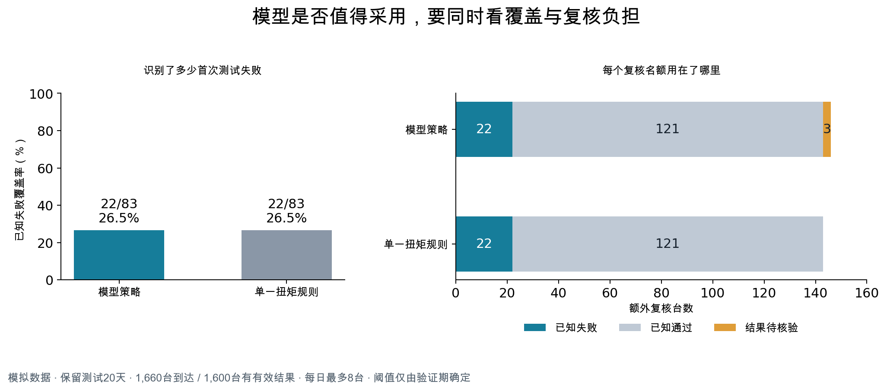

# 装配质量场景验证记录

本附录保留方案实践所依据的模拟实验方法与结果。数据不对应具体工厂，不构成客户成效案例。

[返回方案文章](blog-ml-agent-final.html)

## 实验设计

### 数据与标签

候选特征包括扭矩偏差、拧紧角度偏差、重复拧紧次数、工位等待时间和设备状态。下线测试测量值、测试故障结果及后续返修记录不进入特征；发动机标识仅用于记录关联。

特征同时满足事件时间和数据可用时间要求。例如，发动机在10:00完成装配，一条09:58采集、10:03才写入系统的记录，不能用于10:00的评分。历史数据准备因此需要保留采集、写入和补录信息。

标签取首次有效下线测试结果。测试台中断产生的无效记录不作为失败标签；首次失败、返修后复测通过的对象仍记为首次失败；尚无有效结果的对象保持未知状态。

模拟数据覆盖100天，共8240台发动机。其中8000台具有有效结果，200台只有无效测试记录，40台结果尚待回流。

### 数据划分

有标签样本按时间划分为训练、外部验证和保留测试三部分。

| 数据集 | 时间范围 | 有标签样本数 |
|---|---|---:|
| 训练集 | 前60天 | 4800 |
| 验证集 | 随后20天 | 1600 |
| 测试集 | 最后20天 | 1600 |

模拟数据的关联台账确认，三部分发动机标识无重叠，所用特征在评分时点已经可用。平台的文件指纹校验用于识别已知文件重复使用，实体和时间关系则由上述台账单独核验。

AutoGluon 在训练期数据上完成候选模型训练、选择与集成。[1] 内部模型选择未采用按时间划分的交叉验证。外部验证集用于确定复核策略，保留测试集只检验固定方案，不参与阈值或特征调整。

验证期和测试期各有1660台发动机到达，包含1600台有标签对象和60台未知对象。全部对象均参与评分，未知对象同样占用复核名额，评估时单独列示。

### 复核策略

模型策略以验证期全部到达对象评分的第90百分位为固定阈值，约为0.07687。测试期按到达顺序处理，评分达到阈值且当日仍有容量的对象进入复核名单，每天最多8台。

该策略不使用尚未到达对象的评分，也不依据后续标签修改名单。当天容量提前用完后，晚到的高分对象不再进入额外复核；未达到阈值时，名额可以空余。

比较基线仅使用扭矩偏差，采用相同的验证期阈值确定方法和每日容量上限。该规则为实验基线，真实试点还需与工厂现有规则和工程师判断比较。

## 实验结果

### 复核效果

保留测试期共有1660台发动机到达，其中83台首次有效下线测试不通过。固定策略的回放结果如下。

| 评价指标 | 模型策略 | 扭矩规则 |
|---|---:|---:|
| 额外复核总量 | 146台 | 143台 |
| 占全部到达对象的比例 | 8.8% | 8.6% |
| 覆盖的已知首次失败 | 22台 | 22台 |
| 已知首次失败覆盖率 | 26.5% | 26.5% |
| 复核中最终通过的对象 | 121台 | 121台 |
| 复核中结果未知的对象 | 3台 | 0台 |
| 未被复核覆盖的已知首次失败 | 61台 | 61台 |

两种策略的失败覆盖率均为22÷83。模型策略复核的146台中，143台结果已知，已知结果中的命中率为22÷143，即15.4%；其余3台不计为通过或失败。

*附图A　保留测试中的失败覆盖与复核量。*

模型策略未提高已知失败覆盖数量，两种方法均有61台失败对象未被额外复核覆盖。覆盖数量相同并不代表名单相同；是否存在互补价值，还需核对名单重叠、失败类型和严重程度。本次二元标签不足以支持这些判断。

### 结果分析

默认分类阈值下，模型测试准确率约为94.6%，但只识别出83台首次失败中的1台。若将全部有标签对象预测为通过，准确率也可达到约94.8%。因此，默认分类指标与每日限额复核策略应分别评价；前述26.5%覆盖率属于后者。

按模型每天实际使用的名额进行等量随机选择，理论期望覆盖约7.47台已知失败。模型覆盖22台，风险集中程度高于随机参照，但与扭矩规则相比未显示额外收益。随机参照是数学期望，不是现场试验结果。

本次结果支持保留简单基线，进一步检查数据和业务假设。返修减少、一次通过率提高或等待缩短，需要通过真实干预及其后续结果另行评估。

## 技术验证

本次在 AWS 上执行了训练、模型登记、外部验证、保留测试、离线预测、临时在线预测和资源回收。训练由 SageMaker 承载，AutoGluon 拟合约33.2秒，作业耗时199秒，AWS 计费训练时长159秒；拟合预算120秒不等于端到端耗时或费用上限。

验证集平均精度（AP）约0.2714，保留测试AP约0.1710。内部模型选择分数、外部验证指标和每日限额策略结果采用不同口径，不能混用。

从保留测试中预先固定抽取40台发动机，使用同一固定模型产物执行离线与临时在线预测。分类结果全部一致，概率输出最大差为0。在线路径只有一次40行调用，不足以评价长期时延、吞吐能力或服务等级。

验证结束后主动回收临时端点，并核对端点、配置及服务模型均已不存在，原始数据、登记模型和历史记录保留。未经批准的生产部署被拒绝；没有完成业务生产审批。

每日限额策略由独立分析程序回放，尚未作为原生平台策略服务提供。实体和时点关系来自模拟关联台账，平台保留文件指纹不足以证明切分独立性的提示。

正文图示与视频使用现有门户代码回放保存的实验响应，未重新执行在线流程。Microsoft Entra ID 属于企业身份集成设计，未纳入本次登录验证。

参考资料：

1. AutoGluon，Tabular Quick Start。  
   `https://auto.gluon.ai/stable/tutorials/tabular/tabular-quick-start.html`
